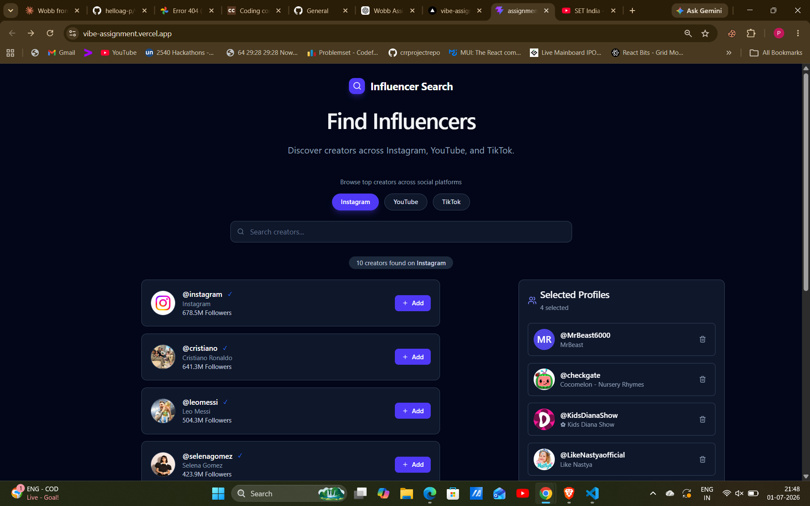
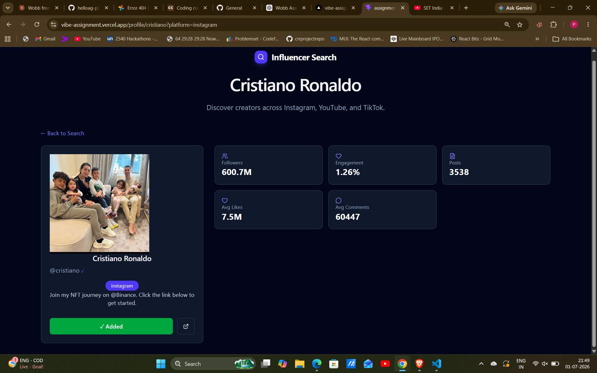
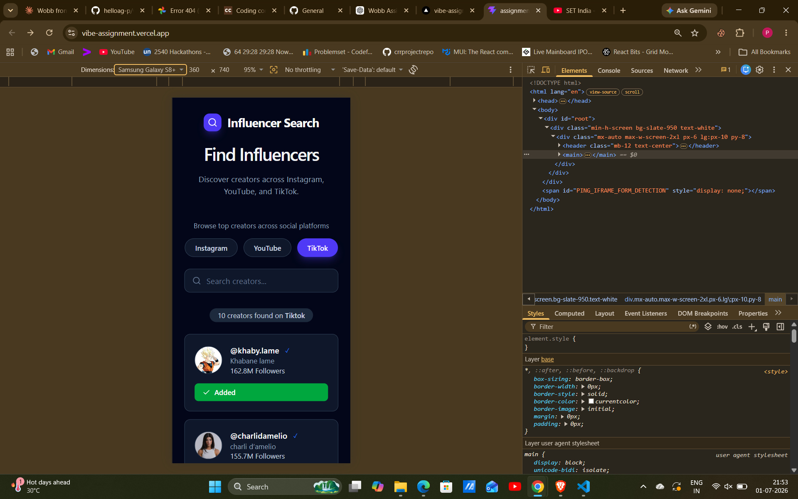

# Wobb Assignment – Influencer Search

A modern influencer search application built with **React**, **TypeScript**, **Vite**, **Tailwind CSS**, and **Zustand**.

This project enhances the provided starter template by improving the UI/UX, replacing React Context with Zustand, fixing existing issues, implementing persistent profile selection, and optimizing the overall codebase.

---

## 🚀 Features

- Search influencers by username or full name
- Filter creators by platform (Instagram, YouTube, TikTok)
- Detailed profile page for every creator
- Persistent "Selected Profiles" list
- Prevent duplicate profile selection
- Remove profiles from the selected list
- Modern responsive UI
- Fallback avatar for broken profile images
- Improved routing and navigation
- Responsive layout for desktop, tablet, and mobile devices

---

## 🛠 Changes Made

### 1. Bug Fixes

- Fixed profile navigation issues
- Fixed username/handle inconsistencies across platforms
- Fixed YouTube profiles missing usernames by generating fallback usernames
- Fixed broken profile image rendering using avatar fallback
- Fixed search reset behavior when switching platforms
- Fixed multiple TypeScript typing issues
- Fixed ESLint warnings
- Improved data extraction from JSON files

---

### 2. UI / UX Improvements

- Redesigned the entire interface with a modern dark theme
- Improved typography and spacing
- Redesigned profile cards
- Redesigned Selected Profiles panel
- Improved search input styling
- Improved platform selector buttons
- Better visual hierarchy
- Added hover states and smoother interactions
- Improved responsive layout across different screen sizes

---

### 3. State Management

Replaced React Context with Zustand.

Implemented:

- Search state management
- Platform state management
- Selected profiles management
- Persistent storage using Zustand persist middleware

---

### 4. Selected Profiles Feature

Implemented complete functionality:

- Add profiles
- Prevent duplicate entries
- Remove profiles
- Persistent selection after page refresh
- Responsive selected profile sidebar

---

### 5. Code Quality Improvements

- Better folder organization
- Cleaner reusable components
- Utility helper functions
- Improved TypeScript types
- Reduced duplicated code
- Better separation of concerns

---

### 6. Performance Improvements

- Memoized ProfileCard using React.memo
- Reduced unnecessary re-renders
- Optimized profile extraction helpers
- Zustand store minimizes component updates
- Cleaner rendering logic

---

## 📚 Libraries Used

- React
- TypeScript
- Vite
- Tailwind CSS
- Zustand
- React Router DOM
- Lucide React

---

## 📂 Project Structure

```
src/
│
├── assets/
│
├── components/
│   ├── Layout
│   ├── PlatformFilter
│   ├── ProfileCard
│   ├── ProfileList
│   ├── SelectedProfiles
│   └── VerifiedBadge
│
├── pages/
│   ├── SearchPage
│   └── ProfileDetailPage
│
├── store/
│   ├── useSearchStore
│   └─useSelectedProfilesStore
│
├── types/
│
├── utils/
│   ├── dataHelpers
│   ├── profileLoader
│   └── formatters
│
└── main.tsx
```

---

## 💭 Assumptions Made

- Local JSON files are treated as the data source.
- Some YouTube profile images are no longer publicly accessible (404). A fallback avatar is displayed instead.
- Missing usernames are generated using available profile information to maintain consistent routing and searching.

---

## ⚖ Trade-offs

- Used local JSON files instead of introducing a backend API.
- Used browser localStorage (via Zustand persist) for selected profiles instead of a remote database.
- Image fallback avatars are used when external image URLs are unavailable.

---

## 🔮 Future Improvements

If given more time, I would implement:

- Infinite scrolling
- Skeleton loading states
- Better accessibility (ARIA labels & keyboard navigation)
- Unit and integration tests
- Profile sorting options
- Search debouncing
- Dark/Light theme toggle
- Better animations and micro-interactions

---

## 💻 Installation

Clone the repository

```bash
git clone https://github.com/helloag-p/vibe-assignment
```

Install dependencies

```bash
npm install
```

Run the development server

```bash
npm run dev
```

---

## 🏗 Build

```bash
npm run build
```

---

## ✅ Lint

```bash
npm run lint
```

---

## 🌐 Live Demo

> Add your Vercel deployment URL here after deployment.

Example:

```
https://vibe-assignment.vercel.app/
```

---

## 📸 Screenshots

### Dashboard



---

### Profile Details



---

### Mobile Responsive View



---

## 👨‍💻 Author

**Parv Agarwal**

GitHub: https://github.com/helloag-p

LinkedIn: https://www.linkedin.com/in/parv-agarwal-09b042215/